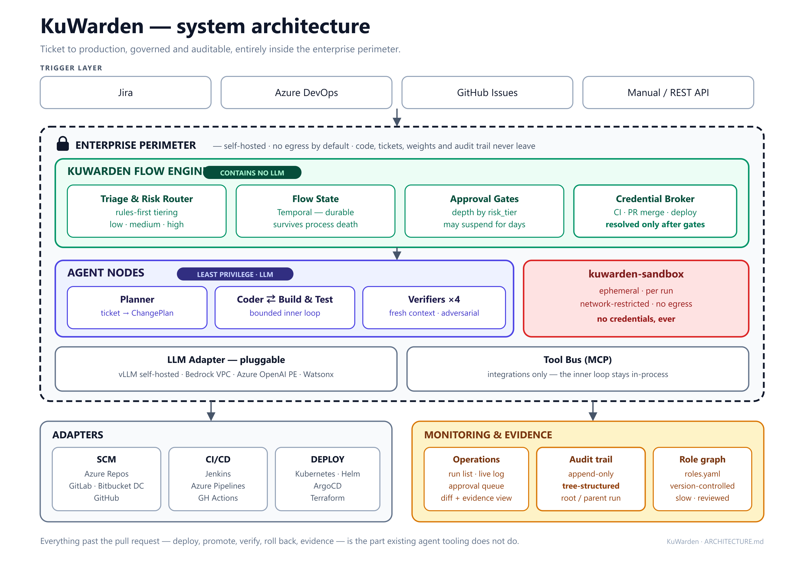
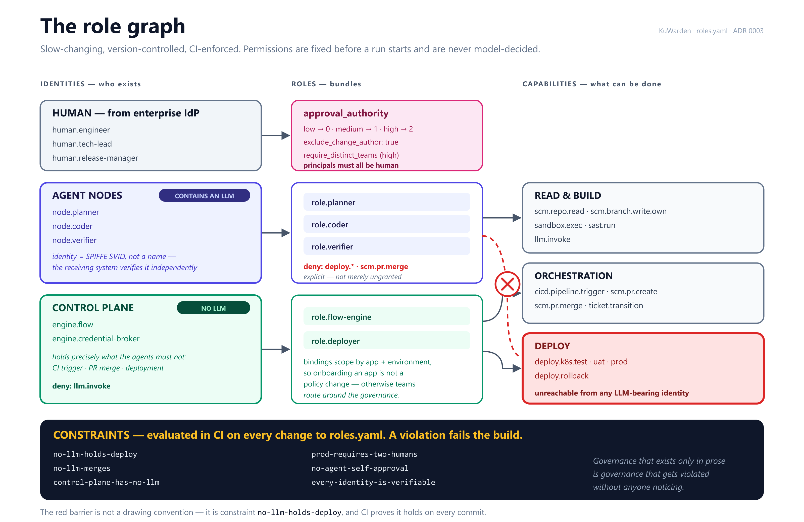
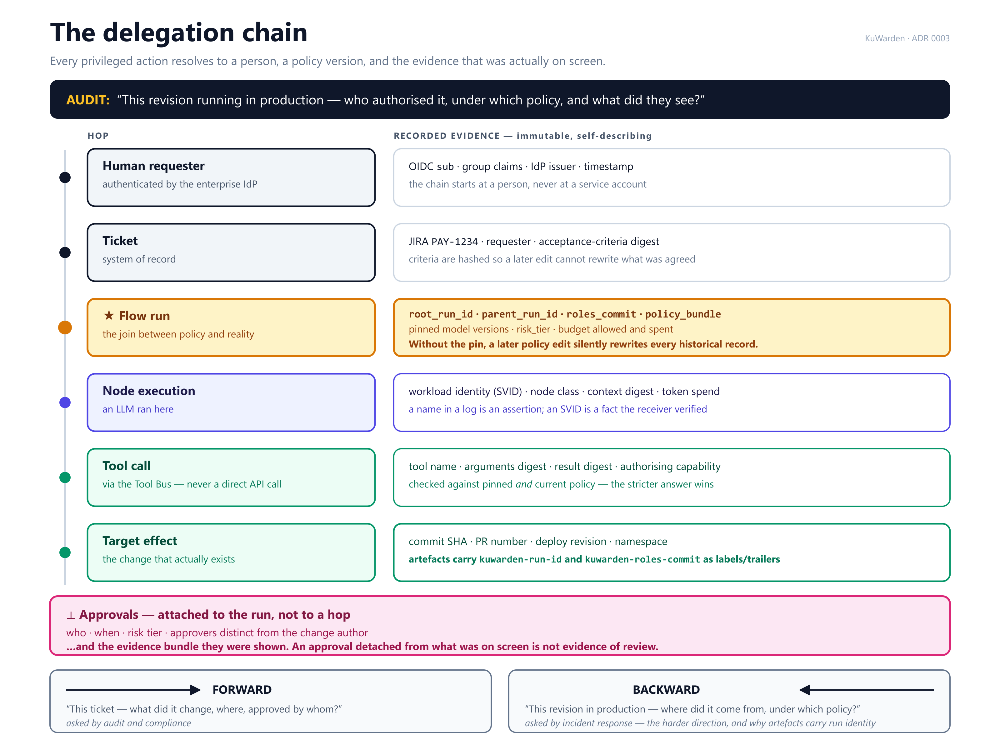

# KuWarden — Architecture

> This document describes the system architecture, component design, data flows, and integration model for KuWarden.

**Governing decisions.** This document is constrained by two architecture decision records.
Read them first if you are changing anything structural:

- [ADR 0001 — Flow Engine as a deterministic control plane](docs/adr/0001-flow-engine-control-plane.md)
- [ADR 0002 — Flow topology: nodes, edges, state, policy](docs/adr/0002-flow-topology.md)
- [ADR 0003 — Role graph and end-to-end traceability](docs/adr/0003-role-graph-and-traceability.md)
- [ADR 0004 — Delivery integration models and the control point](docs/adr/0004-delivery-integration-models.md)
- [ADR 0005 — Execution sandbox contract](docs/adr/0005-sandbox-contract.md)

The single rule they establish, on which everything below depends:

> **The agent guesses. The Flow Engine verifies.
> Whatever must be deterministic, auditable, or privileged does not get to be a model.**

---

## 1. High-Level Overview



<details>
<summary>ASCII version (for terminals and plain-text diffs)</summary>

```
┌─────────────────────────────────────────────────────────────────┐
│                        TRIGGER LAYER                            │
│   Jira Webhook  │  Azure DevOps  │  GitHub Issues  │  Manual    │
└────────────────────────────┬────────────────────────────────────┘
                             │
                             ▼
┌─────────────────────────────────────────────────────────────────┐
│                      KUWARDEN ENGINE                              │
│                                                                 │
│  ┌──────────────┐  ┌──────────────┐  ┌──────────────────────┐  │
│  │ Triage &     │  │ Flow State   │  │  Approval Gate       │  │
│  │ Risk Router  │  │ (Temporal —  │  │  (depth set by       │  │
│  │ (rules-first)│  │  durable)    │  │   risk_tier)         │  │
│  └──────────────┘  └──────────────┘  └──────────────────────┘  │
│         ▲  DETERMINISTIC — no LLM in this layer                 │
│  ┌──────┴───────────────────────────────────────────────────┐   │
│  │                    AGENT NODES                            │   │
│  │                                                           │   │
│  │   [Planner] → [Coder] ⇄ [Build & Test]  ← bounded loop    │   │
│  │                            │  (CI exit code, not a claim) │   │
│  │                            ▼                              │   │
│  │              [Verifiers ×4 — fresh context, fan-out]      │   │
│  │       correctness │ security │ test evidence │ regression │   │
│  └──────────────────────────────────────────────────────────┘   │
│                                                                 │
│  ┌──────────────┐  ┌──────────────┐  ┌──────────────────────┐  │
│  │ LLM Adapter  │  │  Tool Bus    │  │  Event Stream        │  │
│  │ (pluggable)  │  │ (MCP-based)  │  │  (WebSocket / SSE)   │  │
│  └──────────────┘  └──────────────┘  └──────────────────────┘  │
└─────────────────────────────────────────────────────────────────┘
                             │
          ┌──────────────────┼──────────────────┐
          ▼                  ▼                  ▼
┌──────────────────┐ ┌──────────────┐ ┌──────────────────────┐
│   SCM ADAPTER    │ │ CI/CD ADAPTER│ │   DEPLOY ADAPTER     │
│ GitHub / Azure   │ │ GH Actions / │ │  K8s / ArgoCD /      │
│ Repos / GitLab   │ │ Jenkins /    │ │  Helm / Terraform    │
│ / Bitbucket      │ │ Azure Pipes  │ │  / AWS ECS           │
└──────────────────┘ └──────────────┘ └──────────────────────┘
                             │
                             ▼
┌─────────────────────────────────────────────────────────────────┐
│                    MONITORING UI                                 │
│   Agent run list  │  Live step log  │  Approval queue  │ Audit  │
└─────────────────────────────────────────────────────────────────┘
```

</details>

The boundary that the whole design rests on:


---

## 2. Core Components

### 2.1 Flow Engine (Backend — Python / FastAPI / Temporal)

The heart of KuWarden, and the part of the system that **contains no LLM** — see
[ADR 0001](docs/adr/0001-flow-engine-control-plane.md). Responsibilities:

- Receives incoming trigger events (webhooks) and routes them to the correct registered application flow.
- Assigns a **risk tier** to every incoming change, rules-first.
- Instantiates a **flow run** for each trigger.
- Owns **flow state** — durably, so a run survives process death, pod eviction, and KuWarden's own deployments.
- **Verifies objectively.** Gate decisions read results from external systems of record (CI exit code, SAST report, coverage tool, health endpoint). An agent's assertion that its work succeeded is never a gate input.
- Enforces **approval gates** — suspends the run, notifies humans, resumes on signal. A run may sit at a gate for days without holding any resource open.
- **Holds the privileged credentials.** CI trigger, PR merge, and deployment credentials are resolved by the Flow Engine after gates pass. They are never present in a process that has an LLM in it.
- Drives **compensation** — rollback, branch cleanup, ticket transition — when a run fails or crashes.
- Emits a real-time **event stream** to the monitoring UI via WebSocket / Server-Sent Events.
- Exposes a **REST API** for the monitoring UI, manual triggers, and external integrations.

**Tech stack:**
- Runtime: Python 3.12+
- API surface: FastAPI
- **Durable execution: Temporal** — flow state, multi-day timers, human-approval signals, exactly-once side effects, and child workflows
- State store: PostgreSQL (app registry, approvals, audit projection, run tree)
- Queue: Redis (event fan-out to the UI)
- Container: Docker / Kubernetes

> **Why Temporal rather than a state machine over PostgreSQL + Redis.** Persisting step
> progress preserves *data*; it does not preserve *execution*. KuWarden's flows wait days for
> human approval and minutes-to-hours for CI and health checks, and they perform side effects
> that must not repeat on recovery — a naive replay re-opens the pull request, re-comments on
> the ticket, and re-triggers the deployment. Exactly-once side effects, durable timers, and
> workflow versioning are the whole problem, and they are Temporal's problem, not ours.
> Temporal's execution history additionally *is* the append-only audit record, rather than a
> second system to build and reconcile. Full rationale in
> [ADR 0001](docs/adr/0001-flow-engine-control-plane.md).

---

### 2.2 Flow Topology — Nodes

A flow run is a **directed graph of nodes**, not a linear chain. See
[ADR 0002](docs/adr/0002-flow-topology.md) for the full rationale.


Every node has the same signature — `(FlowState) -> FlowState` — so any node can later be
replaced by a child flow without changing its callers.

#### Built-in Nodes

| # | Node | Class | Role | Key Tools |
|---|---|---|---|---|
| ① | **Triage & Risk Router** | `deterministic` (+ advisory LLM) | Assigns `risk_tier`; rejects unclear or out-of-scope tickets back to a human | Ticket API, path rules |
| ② | **Planner** | `generative` | Ticket + codebase → structured change plan | Ticket API, SCM read, LLM |
| ③ | **Coder** | `generative` | Implements the plan inside a sandbox, iterating on build/test feedback | SCM write, file tools, sandbox exec, LLM |
| ④ | **Build & Test** | `deterministic` — **no LLM** | Runs CI; emits the objective verdict | CI/CD trigger + poll, coverage tool |
| ⑤ | **Verifiers ×4** | `verifier` — **fresh context** | Adversarially attempt to falsify the change | SAST runner, SCM read, LLM |
| ⑥ | **Approval Gate** | `deterministic` | Suspends the run; depth determined by `risk_tier` | Notification adapter |
| ⑦ | **Release** | `deterministic` — **no LLM** | The control point. Mechanism set by `integration_model` — see [ADR 0004](docs/adr/0004-delivery-integration-models.md) | SCM PR API, Deploy API, platform gate callback |
| ⑧ | **Abort / Rollback** | `deterministic` | Compensation — rollback, branch cleanup, ticket update | Deploy API, SCM, Ticket API |
| | **Reporter** | `deterministic` | Posts outcome and evidence back to the ticket | Ticket API |

The pipeline is **configurable per application** via `kuwarden.yaml`.

#### The inner loop

`Coder ⇄ Build & Test` is a **bounded cycle**, not a one-shot pass. The Coder receives
compiler and test output from the *previous* attempt and iterates until the build is green or
the retry budget is exhausted. Nearly all of a coding agent's quality comes from this cycle;
generating each file once and hoping does not work.

Loops are not abolished — they are **contained**. A loop lives inside a node, where its
context is bounded and its retries are budgeted. The flow *between* nodes stays deterministic.

#### Context isolation — the rule that makes review real

> **Generative nodes hand off context forward. Verifier nodes do not receive it.**

`Planner → Coder` passes context forward; this is correct. `Coder → Verifier` **must not**.
A verifier that inherits the coder's reasoning chain is reading a completed defence of the
change, and will approve it — the author is marking their own work.

Verifier nodes are constructed in a **new context** and may see only:

- the original ticket and its acceptance criteria,
- the final diff,
- objective evidence — CI result, SAST report, coverage numbers.

They may **not** see the Coder's reasoning, its self-assessment, its prior failed attempts, or
another verifier's verdict. The four verifiers fan out in parallel; they do not vote in
sequence.

| Verifier | Adversarial question |
|---|---|
| **correctness** | Does this actually satisfy the stated acceptance criteria? |
| **security** | SAST findings, plus: injection, authz bypass, secret handling |
| **test evidence** | Were the tests genuinely satisfied, or were they weakened? |
| **regression risk** | Which untested paths does this change reach? |

`test evidence` is not optional. The most common way an agent manufactures success is to
weaken the tests — removing assertions, relaxing a matcher, `assert True`. Much of this check
is deterministic (assertion-count delta, test-file churn disproportionate to source churn),
with an LLM only for the residue.

#### Risk tiering — why gates do not become the bottleneck

The router assigns `risk_tier`, and the tier determines how much human attention a change
consumes:

| Tier | Typical change | Human approval | Deploy |
|---|---|---|---|
| `low` | dependency bump, copy, config, docs | **none** | auto to test |
| `medium` | business logic within one service | 1 approver | test, then promote |
| `high` | authn/authz, payments, DB migration, IaC, secrets | 2 approvers | never automatic |

Tiering is **rules-first** — paths touched, migration directories, security-sensitive globs,
diff size, blast radius. An LLM may contribute, but **only to raise a tier, never to lower
one**. A model must not be able to argue its way into a weaker gate.

Uniform gating is correct for the first ten runs and fatal at a hundred: it turns the platform
into a queue in front of a human, which is the constraint KuWarden exists to relieve.

---

### 2.3 Tool Bus (MCP-based)

KuWarden uses the **Model Context Protocol (MCP)** as the standard interface for all agent tools. This means:

- Each integration (Jira, GitHub, Jenkins, K8s) is an MCP tool server.
- Agents invoke tools by name via the Tool Bus — they do not call external APIs directly.
- New tools can be added without changing agent code.
- Tool calls are logged for auditability.

> **Layering note.** MCP is used for **integrations** — the boundary where a tool is an
> external system with its own auth, rate limits, and audit requirements. It is *not* used
> for the high-frequency inner loop inside a node (file read/write, grep, run tests), where
> per-call serialisation buys latency and no architectural benefit. Inner-loop tools are
> in-process.

**Built-in tool servers:**

| Tool Server | Provides |
|---|---|
| `kuwarden-scm` | git clone, file read/write, PR create, branch ops |
| `kuwarden-jira` | ticket read, comment, status update, label set |
| `kuwarden-ado` | Azure DevOps work item read/update, repo ops |
| `kuwarden-cicd` | trigger pipeline, poll status, fetch logs |
| `kuwarden-deploy` | kubectl apply, helm upgrade, ArgoCD sync trigger |
| `kuwarden-sast` | run Semgrep / Bandit / ESLint security scan |
| `kuwarden-test` | run test suite, parse results, compute coverage |

---

### 2.4 LLM Adapter

A single internal interface — `LLMProvider` — abstracts all LLM backends. The flow engine and agents never call a model API directly; they call the adapter.

```
LLMProvider
├── OpenAICompatibleAdapter   (vLLM, Ollama, LM Studio, Azure OpenAI)
├── BedrockAdapter            (AWS Bedrock via boto3 Converse API)
├── WatsonxAdapter            (IBM Watsonx.ai)
└── (extensible — add new adapters without changing agent code)
```

**Configuration example (`kuwarden.yaml`):**
```yaml
llm:
  planner:
    adapter: bedrock
    model: anthropic.claude-3-5-sonnet-20241022-v2:0
    region: ap-southeast-2
  coder:
    adapter: openai_compatible
    base_url: http://vllm.internal:8000/v1
    model: Qwen2.5-Coder-32B-Instruct
  reviewer:
    adapter: openai_compatible
    base_url: http://vllm.internal:8000/v1
    model: Qwen2.5-Coder-32B-Instruct
```

Different agents can use different models, optimising for cost, quality, and sovereignty requirements.

---

### 2.5 Application Hook (`kuwarden.yaml`)

Every application that uses KuWarden registers itself with a `kuwarden.yaml` file at the repo root. This is the **single configuration file** that tells KuWarden everything it needs to know about the application.

```yaml
# kuwarden.yaml — example for a Java Spring Boot microservice

app:
  name: payments-service
  repo: https://github.com/acme/payments-service
  language: java
  framework: spring-boot

triggers:
  - type: jira
    project_key: PAY
    label: kuwarden-auto          # tickets with this label trigger the flow
    min_story_points: 1
    max_story_points: 5         # only auto-handle small tickets

flow:
  pipeline:
    - planner
    - coder
    - reviewer
    - tester
    - deployer
    - reporter

  approval_gates:
    - after: reviewer           # human must approve before tests run
      notify: slack:#pay-team
    - after: tester             # human must approve before deploy
      notify: slack:#pay-team

  deploy:
    test:
      target: kubernetes
      namespace: payments-test
      manifest_path: k8s/test/
    uat:
      target: kubernetes
      namespace: payments-uat
      manifest_path: k8s/uat/
      requires_approval: true

llm:
  planner:
    adapter: bedrock
    model: anthropic.claude-3-5-sonnet-20241022-v2:0
  coder:
    adapter: openai_compatible
    base_url: http://vllm.internal:8000/v1
    model: Qwen2.5-Coder-32B-Instruct

quality:
  sast: semgrep
  test_coverage_threshold: 80
  branch_protection: true
```

---

### 2.6 Monitoring UI (Frontend — React)

A real-time web dashboard that gives full visibility into every KuWarden agent run.

**Key views:**

| View | Content |
|---|---|
| **Run list** | All active and historical flow runs, status, duration, application |
| **Run detail** | Step-by-step pipeline progress, live log streaming, diff viewer |
| **Approval queue** | Pending human approvals with diff preview and one-click approve/reject |
| **Agent log** | Full LLM prompt/response log per step (with sensitive data masked) |
| **Audit trail** | Immutable record of every action taken, who approved, when |
| **App registry** | All registered applications, their hook config, and run history |

**Tech stack:**
- Framework: React 18 + TypeScript
- UI: Tailwind CSS
- Real-time: WebSocket (live log streaming from engine)
- State: React Query + Zustand
- Served by: Nginx (static build, served from same cluster as engine)

---

## 3. Data Flow — End to End

```
1. TRIGGER
   Jira ticket labelled "kuwarden-auto"
   → Jira webhook fires POST /api/trigger  (idempotent on delivery ID)
   → Flow Router matches ticket to payments-service hook config
   → Temporal workflow started; run recorded with parent_run_id = NULL
   → Run ID returned immediately (async execution begins)

2. ① TRIAGE & RISK ROUTER          [deterministic — no LLM decides the outcome]
   → Evaluates path rules, diff scope hints, story points, ticket completeness
   → Assigns risk_tier: low | medium | high
     · advisory LLM may RAISE the tier; it may never lower it
   → If the requirement is unclear or out of scope:
     REJECT — comment on ticket explaining what is missing, END
     (this is the flow's kill switch, and it fires early and cheaply)

3. ② PLANNER                        [generative]
   → Reads Jira ticket via kuwarden-jira
   → Clones repo at pinned SHA via kuwarden-scm
   → LLM → structured ChangePlan (files, approach, test strategy)

4. ③⇄④ CODER  ⇄  BUILD & TEST      [bounded inner loop]
   → Coder creates feature branch, works inside an ephemeral sandbox
   → Commits with a signed commit (bot service account)
   → Build & Test triggers CI via kuwarden-cicd and polls
   → ★ REALITY ANCHOR: the verdict is the CI system's exit code.
     The Coder's opinion of its own work is not an input.
   → On failure with retries remaining: compiler + test output is fed back
     to the Coder, which iterates. Retry budget and token budget both enforced.
   → On failure with budget exhausted → ⑧ ABORT

5. ⑤ VERIFIERS ×4                   [fresh context, fan-out, adversarial]
   → Each verifier is constructed in a NEW context and receives ONLY:
     the ticket + acceptance criteria, the final diff, and objective evidence
     (CI result, SAST report, coverage).
   → It does NOT receive the Coder's reasoning, self-assessment, or retries.
   → correctness │ security │ test evidence │ regression risk — in parallel
   → Any verifier may block. Blocking returns to ③ (bounded) or ⑧.

6. ⑥ APPROVAL GATE                  [depth set by risk_tier]
   → low    : no human — proceed
   → medium : 1 approver
   → high   : 2 approvers, no automatic deploy
   → Temporal SUSPENDS the workflow. Nothing is held open; the run may wait days.
   → Reviewer sees the diff plus the evidence bundle, not a raw diff alone
   → Notification sent to slack:#pay-team; resumes on approval signal
   → Timeout → ⑧ ABORT

7. ⑦ DEPLOY                         [deterministic — sole credential holder]
   → Raises/merges PR via kuwarden-scm (description generated earlier, not here)
   → ★ Deployment credentials are resolved HERE, by the Flow Engine.
     They were never present in any process containing an LLM.
   → Deploys to payments-test via kuwarden-deploy
   → ★ REALITY ANCHOR: pod readiness + service health endpoint + error rate
     over the soak window
   → Unhealthy → ⑧ ABORT (rollback)

8. ⑧ ABORT / ROLLBACK / CLEANUP     [compensation — reachable from any step]
   → Rolls back the deployment, deletes the branch, transitions the ticket
   → Runs even if the original worker process died — this is why the
     control plane sits outside the thing that can crash

9. REPORTER
   → Posts to Jira: PR link, CI result, coverage, SAST summary, verifier
     verdicts, who approved, deploy URL
   → Transitions ticket status
   → FlowRun state: COMPLETED

10. MONITORING UI + AUDIT
    → Full run visible: nodes, logs, diffs, evidence, approvals, timings
    → Audit record is a TREE (root_run_id / parent_run_id), so a change that
      spans several services reports as one auditable unit
    → Append-only; Temporal execution history is the record of authority
```

---

## 4. Deployment Architecture

KuWarden is deployed as a set of Kubernetes workloads. All components run inside the enterprise's own cluster.

```
┌────────────────────────────────── Kubernetes Cluster ────────────────────────────────┐
│                                                                                       │
│  ┌─────────────────┐   ┌─────────────────┐   ┌──────────────────────────────────┐   │
│  │  kuwarden-engine  │   │  kuwarden-ui      │   │  kuwarden-worker (agent runners)   │   │
│  │  (FastAPI)      │   │  (React/Nginx)  │   │  (auto-scaled, ephemeral pods)   │   │
│  │  2 replicas     │   │  2 replicas     │   │  0-N replicas (HPA)              │   │
│  └────────┬────────┘   └─────────────────┘   └──────────────────────────────────┘   │
│           │                                                                           │
│  ┌────────▼────────┐   ┌─────────────────┐   ┌──────────────────────────────────┐   │
│  │  Temporal       │   │  PostgreSQL     │   │  vLLM (optional self-hosted LLM) │   │
│  │  (durable exec, │   │  (registry,     │   │  GPU node pool                   │   │
│  │   audit history)│   │   audit proj.)  │   │                                  │   │
│  └─────────────────┘   └─────────────────┘   └──────────────────────────────────┘   │
│                                                                                       │
│  ┌─────────────────┐   ┌──────────────────────────────────────────────────────────┐  │
│  │  Redis          │   │  kuwarden-sandbox (ephemeral, network-restricted)          │  │
│  │  (UI event bus) │   │  per-run build/test execution — no egress, no creds      │  │
│  └─────────────────┘   └──────────────────────────────────────────────────────────┘  │
│                                                                                       │
└───────────────────────────────────────────────────────────────────────────────────────┘
         │                         │                          │
         ▼                         ▼                          ▼
   Jira / Azure DevOps        GitHub / GitLab /          AWS Bedrock
   (webhook in)               Azure Repos                (via VPC endpoint)
```

**Helm chart provided** — single `helm install kuwarden ./charts/kuwarden` to deploy everything.

---

## 5. Security Architecture

| Concern | Approach |
|---|---|
| **Workflow-definition write escalation** | **Primary threat.** CI definitions live inside the branch the Coder can write. A workflow file is executable on push/PR, so an agent that can write code could otherwise run arbitrary code with CI credentials. Mitigated by `protected_paths` in `policy.yaml` — a hard deny at the SCM tool boundary, enforced again on `changed_files`. See [ADR 0004](docs/adr/0004-delivery-integration-models.md). |
| **Prompt injection via ticket content** | **Primary threat.** Anyone who can file a ticket can write text an agent reads as instructions. Mitigated architecturally, not by prompting: agents hold no privileged credentials (below), all gates are anchored to machine-verifiable facts, and risk tiering is rules-first so a model cannot argue its way into a weaker gate. See `THREAT_MODEL.md`. |
| **Credential boundary** | Agent nodes hold read-only repo access plus write access to their own feature branch — nothing else. CI trigger, PR merge, and deployment credentials are held by the Flow Engine and resolved only after gates pass. No credential is ever present in a process containing an LLM. |
| **Separation of duties** | The component that produces a change is never the component that certifies it, and never the component that releases it. Gate verdicts read external systems of record (CI exit code, SAST, coverage, health endpoint), never an agent's assertion. |
| **Source code in LLM prompts** | Code snippets sent to LLM only over private endpoints (VPC / self-hosted). Never to public APIs. |
| **Secrets management** | All secrets in Kubernetes Secrets / HashiCorp Vault. Never passed to LLM prompts. |
| **SCM authentication** | Short-lived tokens via GitHub App / Azure DevOps service connection. Rotated per run. |
| **Commit signing** | All agent commits signed with a KuWarden bot GPG key. |
| **Least privilege** | Each tool server uses its own service account with minimum required permissions. |
| **Audit log integrity** | Flow run logs written append-only to PostgreSQL. Cannot be modified after write. |
| **UI authentication** | OIDC / OAuth 2.0 via enterprise IdP (Azure AD, Okta, Keycloak). |
| **Network policy** | Kubernetes NetworkPolicy — engine pods cannot reach the internet directly. |

---

## 6. Governance & Traceability

Specified in full by [ADR 0003](docs/adr/0003-role-graph-and-traceability.md).

### 6.1 The role graph — `policy.yaml`

Which identities exist and what each may do. Slow-changing, version-controlled,
change-reviewed. It describes the **platform deployment**, and is distinct from `kuwarden.yaml`,
which describes an **application's flow** — an application cannot grant itself capabilities;
`kuwarden.yaml` may only select from what `policy.yaml` already permits.

A non-human identity is a **verifiable workload identity** (SPIFFE SVID, or an
IdP-federated ServiceAccount), not a name. A name in a log is an assertion; a workload
identity is a fact the receiving system verified.



The role graph carries its own `constraints`, evaluated in CI on every change. This is the
machine-checkable form of the rule in [ADR 0001](docs/adr/0001-flow-engine-control-plane.md):
if someone grants the Coder deploy access, the build fails. Governance that exists only in
prose is governance that gets violated without anyone noticing.

Reference: [docs/reference/policy.example.yaml](docs/reference/policy.example.yaml).

### 6.2 Policy pinning — the join

**A role graph on its own is not traceability.** It states what *may* happen; the run tree
states what *did*. Traceability is the join, and the join is sound only if every run records
which policy version authorised it:

```sql
ALTER TABLE flow_runs
  ADD COLUMN policy_commit     TEXT  NOT NULL,   -- git SHA of policy.yaml at run start
  ADD COLUMN policy_bundle JSONB NOT NULL;   -- resolved effective policy, self-describing
```

Without the pin, a later policy edit silently rewrites the meaning of every historical
record. Child runs inherit the parent's `policy_commit`.

**Revocation — deny wins.** Pinning must not become a way to keep using a withdrawn
permission. Every privileged action is checked against **both** the pinned and the current
policy, and the more restrictive answer applies — including for runs already suspended at an
approval gate.

### 6.3 The delegation chain



Traceability must resolve in **both** directions:

| Direction | Question | Asked by |
|---|---|---|
| Forward | This ticket — what did it change, where, approved by whom? | Audit, compliance |
| Backward | This revision in production — where did it come from, under which policy, on what evidence? | Incident response, security |

Backward resolution drives a concrete requirement: **deploy artefacts carry the run identity**.
Commit trailers, image labels and deployment annotations all record `kuwarden-run-id` and
`kuwarden-policy-commit`. Without this, backward lookup degrades into correlating timestamps, which
fails exactly when it is needed most.

Approvals record **the evidence bundle the approver was shown**, not merely that they
approved. An approval detached from what was on screen is not evidence of review.

---

## 7. Delivery Integration Models

Specified in full by [ADR 0004](docs/adr/0004-delivery-integration-models.md).

Most enterprises already have a pipeline: on GitHub a merge fires Actions, on Azure DevOps it
fires Pipelines. The deployment then runs on a platform runner with that platform's own
credentials — outside KuWarden. The design therefore does not assume KuWarden performs the
deployment. It assumes only this:

> **Place the gate at the last point where KuWarden can still refuse.
> Where that point is depends on who performs the deployment.**

Each application declares its model in `kuwarden.yaml`:

| | **A. `kuwarden_deploys`** | **B. `gated_merge`** | **C. `gated_deployment`** |
|---|---|---|---|
| Who deploys | KuWarden | Existing CI/CD | Existing CI/CD |
| Control point | The deploy action | Branch protection / required status check | Platform-native deployment protection rule |
| Holds deploy credentials | Yes | No — holds **merge** authority | No |
| Invasiveness | High — existing CD must be restricted | Low | Low |

**Model C is the default** where the platform supports it (GitHub Environments + deployment
protection rules; Azure DevOps environment approvals and checks; GitLab protected
environments). The customer's pipeline runs unchanged, pauses at deployment, and asks KuWarden.
KuWarden holds no deployment credential and modifies no pipeline, yet is still the gate.

In all three models the **Coder holds none of these permissions**.

### 7.1 Authorised vs observed

> **The audit trail distinguishes what KuWarden *authorised* from what it merely *observed*.**

Under Model B, KuWarden authorises the merge; what the pipeline then deployed is learned from a
webhook. Recording that as "authorised" would be manufacturing evidence — for a product whose
value is compliance evidence, a worse failure than any missing feature.

```sql
ALTER TABLE flow_events
  ADD COLUMN control_mode TEXT NOT NULL
    CHECK (control_mode IN ('authorized', 'observed'));
```

`control_mode` is shown in the Monitoring UI and every exported report. It is never inferred
and never defaulted.

---

*See [ADR 0001](docs/adr/0001-flow-engine-control-plane.md) for why the Flow Engine is deterministic and credential-bearing.*  
*See [ADR 0002](docs/adr/0002-flow-topology.md) for the flow graph, context-isolation rule, and risk tiering.*  
*See [docs/diagrams](docs/diagrams) for rendered and presentation-quality versions of the diagrams above.*  
*See [LLM_STRATEGY.md](./LLM_STRATEGY.md) for detailed LLM backend options.*  
*See [ROADMAP.md](./ROADMAP.md) for phased delivery plan.*
