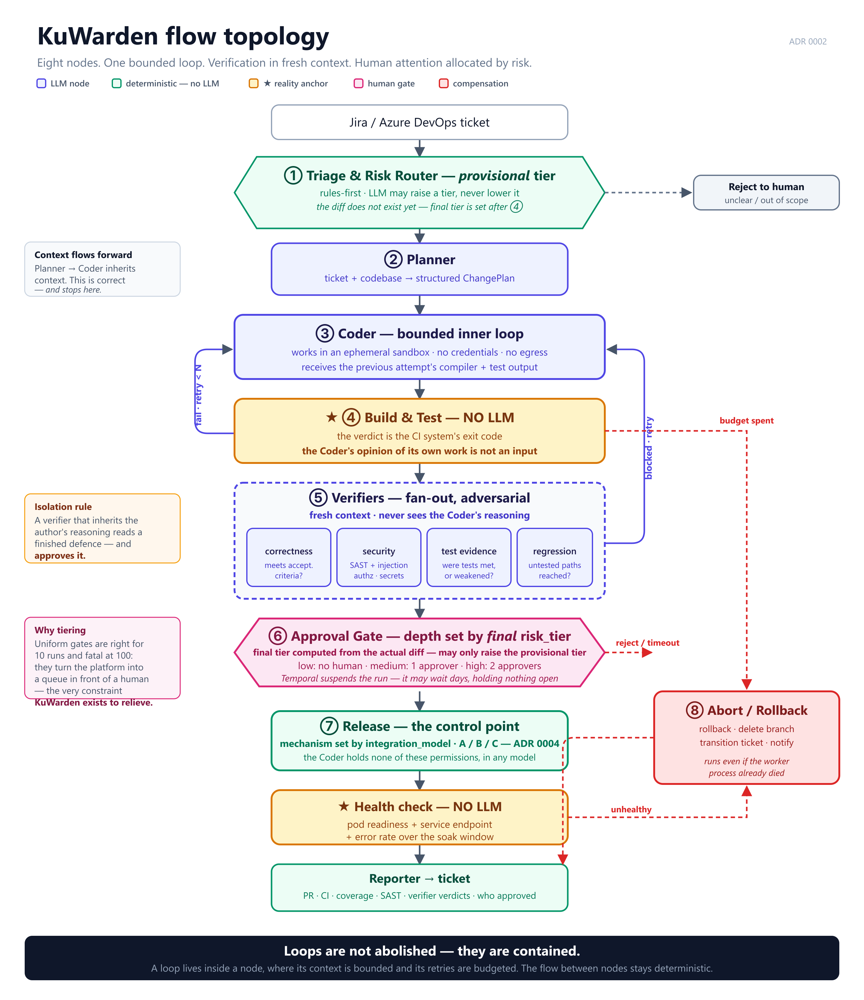
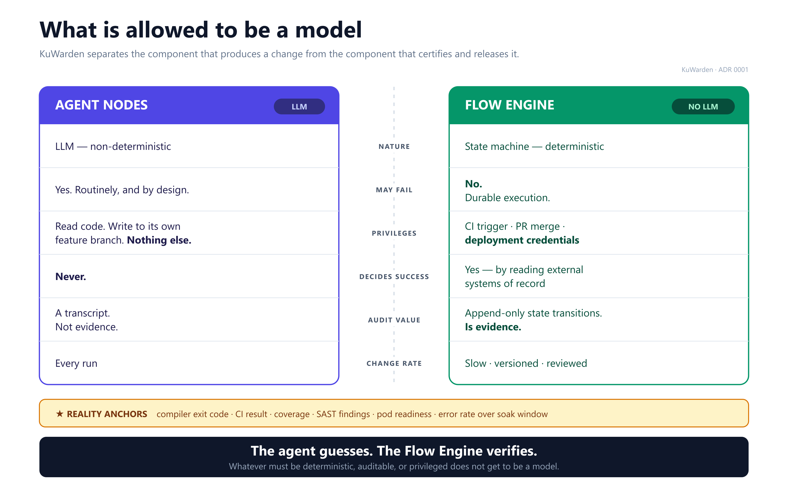

# KuWarden

> Governed, auditable change delivery — from ticket to production — for enterprises that
> cannot put their code on someone else's cloud.

**Status: pre-implementation.** The architecture is decided and recorded; the code is not yet
written. See [Where things stand](#where-things-stand).

---

## What it does

KuWarden sits between your ticket system and your environments. A ticket becomes a planned,
implemented, independently verified, human-approved, released and *evidenced* change — without
a developer hand-off at every step, and without your source code leaving your network.

```
Jira / Azure DevOps ticket
   → ① triage & risk router      (deterministic — rejects unclear work early)
   → ② planner                   (LLM)
   → ③ coder ⇄ ④ build & test    (LLM, bounded loop — the verdict is the CI exit code)
   → ⑤ verifiers ×4              (LLM, fresh context, adversarial)
   → ⑥ approval gate             (depth set by risk tier — may suspend for days)
   → ⑦ release                   (deterministic — holds the credentials)
   → evidence
```



---

## The idea in one rule

> **The agent guesses. The Flow Engine verifies.
> Whatever must be deterministic, auditable, or privileged does not get to be a model.**

The component that produces a change is never the component that certifies it, and never the
component that releases it. That separation is what makes the audit trail worth anything.



---

## Why this and not the alternatives

The market for "run coding agents" is crowded and well funded — GitHub Agent HQ, UiPath for
Coding Agents, Atlassian Rovo Dev, OpenHands. **KuWarden does not compete there.**

Three things remain genuinely underserved, and they are the whole product:

| | |
|---|---|
| **Sovereignty, off GitHub** | Azure DevOps, on-prem GitLab, Bitbucket Data Center. On-prem model weights. Nothing leaves the perimeter. |
| **Everything past the PR** | Agent HQ, Rovo Dev, Devin and OpenHands all stop at the pull request. Release, promotion, rollback and verification are where the risk and the evidence live. |
| **Evidence as the product** | A change in production resolves to a person, a policy version, and what the approver actually saw. 84% of organisations cannot currently pass an audit of agent behaviour. |

See [docs/TOOLS_LANDSCAPE.md](docs/TOOLS_LANDSCAPE.md) and [NON_GOALS.md](NON_GOALS.md).

---

## Documentation map

Read in this order.

| | |
|---|---|
| **[CLAUDE.md](CLAUDE.md)** | **Start here to write code.** Invariants, the determinism boundary, conventions. |
| [VISION.md](VISION.md) | Problem, positioning, who it is for |
| [NON_GOALS.md](NON_GOALS.md) | What we deliberately do not do, and why |
| [ARCHITECTURE.md](ARCHITECTURE.md) | Components, flow topology, data flow, security, governance |
| [docs/adr/](docs/adr/) | The decisions — and the rejected alternatives with revisit triggers |
| [docs/GLOSSARY.md](docs/GLOSSARY.md) | Fixed vocabulary. Terminology drift has already caused one design error. |
| [LLM_STRATEGY.md](LLM_STRATEGY.md) | Backend selection and data sovereignty |
| [ROADMAP.md](ROADMAP.md) | Phased delivery |
| [log/](log/) | How it actually got built, including what turned out to be wrong |

### Architecture decisions

| # | Decision |
|---|---|
| [0001](docs/adr/0001-flow-engine-control-plane.md) | Flow Engine as a deterministic control plane — and why Temporal, not a hand-rolled state machine |
| [0002](docs/adr/0002-flow-topology.md) | Flow topology — the bounded inner loop, verification in fresh context, risk-tiered gates |
| [0003](docs/adr/0003-role-graph-and-traceability.md) | Role graph and end-to-end traceability — policy pinning, deny-wins revocation |
| [0004](docs/adr/0004-delivery-integration-models.md) | Delivery integration models — where the control point sits when someone else's CI deploys |
| [0005](docs/adr/0005-sandbox-contract.md) | Execution sandbox contract |

---

## Running it locally

Requires a container runtime with Compose support (Podman or Docker).

Set a database password first — there is no default, and `compose up` refuses to start
without one:

```bash
cp .env.example .env && python -c "import secrets; print('KUWARDEN_POSTGRES_PASSWORD=' + secrets.token_urlsafe(32))" >> .env
```

```bash
podman compose up -d --wait
```

Two containers, no application:

| | |
|---|---|
| **Temporal** | `localhost:7233` · Web UI at [localhost:8233](http://localhost:8233) — the dev server, embedded SQLite, no external database needed |
| **PostgreSQL** | `localhost:5432` · database `kuwarden`, user `kuwarden`, password from `.env` |

The engine is **not** a service in [compose.yaml](compose.yaml). It runs on the host under
`uv run`, so editing code does not mean rebuilding an image — and so that everything in that
file is precisely the part a cloud deployment replaces with a managed service. Migrating means
deleting the file, not rewriting it.

Other settings are overridable via `.env` — see [.env.example](.env.example). Ports bind to
`127.0.0.1` only, which is defence in depth rather than the control: no credential in this
repository has a working default.

```bash
podman compose down
```

State survives that. To discard it, `podman compose down -v`.

### The engine

A master key is needed before any credential can be stored — see
[ADR 0006](docs/adr/0006-credential-storage.md). Generate one, append it to `.env`, and
**back it up somewhere other than your database backup**: losing it means every stored
credential has to be re-entered.

```bash
uv run python -m engine.adapters.secrets keygen >> .env
```

```bash
uv sync && uv run python -m engine.db migrate && uv run python -m engine.worker
```

### The Workbench

```bash
uv run uvicorn engine.api.main:app --reload --port 8080
```

[localhost:8080](http://localhost:8080) — register an application, store its credentials,
probe what the platform can actually do. Credentials are **write-only**: they are encrypted
before reaching PostgreSQL and no endpoint returns one, only whether it exists.

Then run the suite — the walking-skeleton tests need the stack up, and skip themselves when
Temporal is unreachable:

```bash
uv run pytest
```

Workflow histories are visible at [localhost:8233](http://localhost:8233) while runs execute.

---

## Where things stand

**Decided and recorded.** Notably the choices that are expensive to retrofit: durable
execution, the tree-structured audit trail (`parent_run_id`), policy pinning (`policy_commit`),
the uniform node contract, and the sandbox contract.

**Not yet written.**

| Item | Note |
|---|---|
| Nodes that do anything | The walking skeleton runs eight empty nodes end to end. Models go in after the control plane is proven, not before |
| `THREAT_MODEL.md` | Primary threats identified: prompt injection via ticket content, workflow-definition write escalation |
| `EVALUATION.md` | Blocks any claim that the verifier design works |
| `policy.yaml` schema + constraint evaluator | Until it exists, the constraints in [policy.example.yaml](docs/reference/policy.example.yaml) are decorative |

**Naming.** This project was called *KuFlow* until 2026-08-08. It was renamed because
[kuflow.com](https://kuflow.com) is an unrelated existing product in an adjacent category — a
Temporal-based workflow engine with human tasks. The rename happened before any package paths
existed, which was the cheapest moment it could have.

*Warden*: one who guards, and one who keeps the records. Both halves of the product.

---

## Licence

[MIT](LICENSE)
