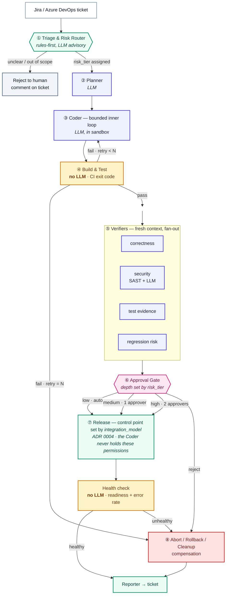

# ADR 0002 — Flow topology: nodes, edges, state, policy

- **Status:** Accepted
- **Date:** 2026-08-07
- **Depends on:** [ADR 0001 — Flow Engine as a deterministic control plane](0001-flow-engine-control-plane.md)
- **Constrains:** [ARCHITECTURE.md](../../ARCHITECTURE.md), PostgreSQL schema, `kuwarden.yaml` schema

---

## Context

[ADR 0001](0001-flow-engine-control-plane.md) establishes *that* a deterministic Flow Engine
owns the run. This record fixes *what shape* the run has.

Three problems drive the shape:

**A linear hand-off chain produces bad code.** The originally documented pipeline —
`Planner → Coder → Reviewer → Tester → Deployer`, each agent's output becoming the next
agent's input — generates each file once, with no compile, no test feedback, and no
iteration. Nearly all of a coding agent's quality comes from the inner loop: act, run tests,
read the failure, fix, repeat. That loop was missing.

**Sequential context hand-off makes review theatre.** The same rule that is correct for
`Planner → Coder` is actively harmful for `Coder → Reviewer`. A reviewer that inherits the
coder's reasoning chain is reading a completed defence of the change. It will approve.
Review must happen in a context that never saw the author's justification.

**Blocking human gates recreate the bottleneck KuWarden exists to remove.** 2026 data is
consistent on this: the binding constraint in enterprise AI-assisted delivery is *human
review capacity*, not code generation. A design with two mandatory human gates per run
scales into the exact problem it was built to solve.

---

## Decision

**A flow is a directed graph of four elements — nodes (V), edges (E), state (S), policy (P)
— with a risk-tiered router at intake, an iteration loop around code generation, and
verification performed in isolated context.**

Loops are not abolished; they are **contained**. A loop lives *inside* a node, where its
context is bounded and its retries are budgeted. The flow between nodes stays deterministic.

### The MVP topology — eight nodes



In topology terms this is a **pipeline**, plus one **router**, one **fan-out/fan-in diamond**
(the verifiers), and one **bounded cycle** (`Coder ↔ Build & Test`). There is deliberately no
agent swarm and no LLM-planned decomposition.

### Node contract

Every node has the same signature, so that any node can later be replaced by a sub-flow
without changing its callers:

```
node: (FlowState) -> FlowState
```

Nodes are classified, and the classification is enforced:

| Class | May call an LLM | Examples |
|---|---|---|
| `deterministic` | **No** | Router rules, Build & Test, Deploy, Rollback, Reporter |
| `advisory` | Yes, output is a *suggestion* only | Risk-tier hinting |
| `generative` | Yes | Planner, Coder |
| `verifier` | Yes, in **fresh context** | Correctness, security, test evidence, regression risk |

### Rule: verification runs in a clean context

**Verifier nodes are constructed with a new context. They may see:**

- the original ticket and its acceptance criteria,
- the final diff,
- objective evidence (CI result, SAST report, coverage numbers).

**They may not see:**

- the Coder's reasoning or self-assessment,
- the Coder's prior failed attempts,
- any prior verifier's verdict (verifiers do not vote in sequence, they fan out in parallel).

This directly overrides the rule previously stated in
[ARCHITECTURE.md](../../ARCHITECTURE.md) §2.2 ("each agent's output becomes the next agent's
input context"), which remains correct only for `Planner → Coder`.

Verification is **adversarial by construction**: a verifier's task is to attempt to falsify
the change, not to assess it neutrally. A change ships when it survives, not when it is
liked.

`test evidence` is not optional. The most common way a coding agent manufactures success is
to weaken the tests — deleting assertions, relaxing a matcher, or writing `assert True`. Much
of this check is deterministic (assertion-count delta, diff touching test files
disproportionately to source) and should be, with an LLM only for the residue.

### Rule: risk tiering, not uniform gating

The router assigns `risk_tier`, and the tier — not a global setting — determines how much
verification and how much human approval a change receives.

| Tier | Typical change | Verification | Human approval | Deploy |
|---|---|---|---|---|
| `low` | dependency bump, copy, config, docs | full automated | **none** | auto to test |
| `medium` | business logic within one service | full automated | 1 approver | test, then promote |
| `high` | authn/authz, payments, DB migration, IaC, secrets handling | full automated + extended soak | 2 approvers | never automatic |

Tiering is **rules-first**: paths touched, migration directories, files matching a
security-sensitive glob, diff size, blast radius of the target service. An LLM may
contribute, but **only to raise a tier, never to lower one**. A model must not be able to
argue its way into a weaker gate.

#### Tiering is two-stage

The facts tiering depends on — which paths the diff touches, whether it reaches
`migrations/`, how large it is — **do not exist at intake.** There is no diff yet. Tiering
therefore happens twice:

| | When | Basis | Purpose | Authority |
|---|---|---|---|---|
| **Provisional** | ① Triage | ticket metadata, the application's declared scope in `kuwarden.yaml`, story points, labels | admission control and budget allocation | may be wrong |
| **Final** | after ④, before ⑥ | **the actual diff** and its evidence | sets gate depth | authoritative |

"May only be raised, never lowered" applies to **both** stages: the final tier may escalate a
provisionally-`low` change to `high`, never the reverse. A change whose final tier exceeds the
budget its provisional tier allocated does not proceed on the old allocation — it re-enters
the gate at the higher tier.

This is what prevents approval gates from becoming the system bottleneck: scarce human
attention is spent only where risk warrants it — and it is spent on the basis of what the
change *actually is*, not what the ticket claimed it would be.

### State (S)

One serialisable object flows along the edges and is versioned from the first commit:

```python
@dataclass
class FlowState:
    schema_version: int          # bump on every breaking change; never remove fields in place
    run_id: UUID
    parent_run_id: UUID | None   # see "Recursive composition"
    root_run_id: UUID

    ticket: Ticket
    risk_tier: Literal["low", "medium", "high"]

    plan: ChangePlan | None
    branch: str | None
    diff: Diff | None

    ci_result: CIResult | None           # reality anchor
    sast_result: SASTResult | None       # reality anchor
    coverage: float | None               # reality anchor
    verifications: list[Verification]
    approvals: list[Approval]

    budget_cents_allowed: int
    budget_cents_spent: int
    retry_count: int
    artifacts: list[Artifact]
```

Secrets never appear in `FlowState`. Credentials are resolved at the point of use by the
Flow Engine and are not carried on the state object — see
[ADR 0001](0001-flow-engine-control-plane.md).

### Policy (P) — the role graph

A distinction is drawn between two graphs, and they have different change controls:

| | **Work graph** | **Role graph** |
|---|---|---|
| What | The path one run actually took | Which agents exist, their tool grants, who may approve what, budget ceilings, per-node model pinning |
| Change rate | Every run | Slow |
| Authority | Emergent | Version-controlled, change-reviewed |
| Storage | Execution history | `policy.yaml`, under `git` |

**Permissions are never model-decided.** Which agent may write where, which principal may
deploy to production, and what a run may spend are role-graph facts, fixed before the run
starts. The role graph is also the artefact handed to auditors, and is what satisfies the
"which agent acted under whose authorisation" requirement appearing in 2026 agentic
governance frameworks.

### Recursive composition — kept open, not built

Nodes are recursively composable: any node may later be replaced by a **child flow** without
changing its callers. This is Temporal's child-workflow model and requires no multi-agent
machinery.

Enabling this costs almost nothing now and is expensive to retrofit, so five properties are
established from the first commit:

1. Uniform node signature — `(FlowState) -> FlowState`.
2. `FlowState` is serialisable and carries `schema_version`.
3. Budget is **inheritable**: a parent's allowance is divided among children, never
   duplicated. Without this, fan-out later becomes an unbounded billing event.
4. `risk_tier` propagates downward and may only be **tightened** by a child.
5. **The audit trail is a tree, not a list.**

Property 5 is the only one that is genuinely painful to retrofit, because audit data is
append-only by definition and therefore cannot be migrated freely. Two columns now avoid it:

```sql
CREATE TABLE flow_runs (
    id             UUID PRIMARY KEY,
    parent_run_id  UUID REFERENCES flow_runs(id),   -- NULL for a root run
    root_run_id    UUID REFERENCES flow_runs(id) NOT NULL,
    app_id         UUID NOT NULL REFERENCES app_registry(id),
    risk_tier      TEXT NOT NULL CHECK (risk_tier IN ('low','medium','high')),
    state          TEXT NOT NULL,
    schema_version INT  NOT NULL,
    created_at     TIMESTAMPTZ NOT NULL DEFAULT now(),
    ...
);
CREATE INDEX flow_runs_root_idx   ON flow_runs (root_run_id);
CREATE INDEX flow_runs_parent_idx ON flow_runs (parent_run_id);
```

This also makes the audit report answer a question compliance functions actually ask:
*"this one change — which systems did it touch, in total?"*

---

## Consequences

### What this buys

- Code quality comes from the `Coder ↔ Build & Test` cycle rather than from one-shot
  generation.
- Review is real review, because the reviewer never sees the author's argument.
- Human attention scales with risk instead of with volume.
- Cross-service and bulk-migration flows can be added later without reshaping the graph or
  migrating audit history.

### What this costs

- Four verifier prompts to maintain instead of one reviewer prompt, and a set of new failure
  modes (verifier disagreement, verifier false-positives blocking valid changes).
- Risk-tiering rules are app-specific and will need tuning per registered application; a
  mis-tiered change is a governance incident, not a bug.
- Retry budgets, token budgets, and soak windows are now tunable parameters that need
  defaults and evidence behind them.

### What we now owe

- `EVALUATION.md` must measure verifier precision/recall, not just end-to-end success —
  a verifier that blocks good changes is as expensive as one that passes bad ones.
- Success metrics must be anchored to reality, or the system will optimise the wrong thing.
  Goodhart's law applies with force here: an agent rewarded for *tickets closed* learns to
  close tickets.

  | Do not measure | Measure |
  |---|---|
  | PRs opened | **PR merge rate** |
  | Tickets auto-closed | **Merged changes surviving N days without rollback or hotfix** |
  | Tests passing | **Lines changed by the human reviewer before merge** |
  | Flow completion rate | **Human minutes consumed per run** |

  The last is the only figure that demonstrates KuWarden saved anyone any work.

---

## Alternatives considered

### `orchestrator-workers` — an LLM that decomposes the task and dispatches sub-agents

*Rejected for now. Explicitly retained as a future option.*

#### The criterion is coupling, not knowability

An earlier formulation of this decision used "is the decomposition statically derivable?" as
the test. That is the wrong variable. A change spanning an API, its client and a schema *is*
statically derivable from the service catalogue — and is still exactly the change that must
**not** be split:

| | Library bump across 200 repos | API + client + schema |
|---|---|---|
| Decomposition known upfront? | Yes | Yes |
| **Sub-changes share a contract?** | **No** — each repo is independent | **Yes** — the schema *is* the contract |
| Correct shape | fan-out, N child flows | **one agent, one coherent change** |

The governing rule:

> **Default to a single agent. Fan out only when the sub-units share no contract.**

Contract-coupled sub-changes authored in separate contexts drift — one side writes `userId`,
the other reads `user_id`, each side's tests pass, and the failure appears only when they
meet. **Consistency has to come from a single authoring context; it cannot be recovered by
reconciliation afterwards.**

This is consistent with what the published multi-agent results actually show. The workloads
where multi-agent wins are *research* — genuinely independent branches — and they win at
roughly 15× the token cost of a single agent. KuWarden qualifies for multi-agent on *context
isolation* and *specialisation*, not on *parallelism*.

#### Authoring and delivery split differently

Single-agent authoring does not mean the whole flow stays unified. Three services cannot be
deployed as one step: each has its own CI and rollout, and ordering matters (schema before
API before client; the reverse on rollback).

> **Consistency by unification, safety by sequencing. Author together, deliver in order.**

So the fan-out moves from the authoring stage to the **release** stage, where it is
deterministic and ordered. This has one concrete consequence recorded in
[ADR 0005](0005-sandbox-contract.md): the Coder operates on a **workspace** spanning multiple
repositories, not on a single repository.

It also exposes a genuinely hard problem this ADR does not solve: three repositories mean
three pull requests, so a contract-coupled change is **not atomic on landing**. The industry
answer is expand/contract — a sequence of individually backward-compatible changes — which
means such work is often best expressed as *several* flow runs rather than one. The risk
router can detect the unsafe shape (a breaking schema change and a client change in the same
run) and force `high` tier or reject with guidance.

**Revisit triggers.** Reopen this decision if any of the following becomes routine:

- **decoupled** bulk work becomes common — N repositories receiving the same mechanical
  change with no shared contract between them (note: *coordinated* cross-service changes are
  not a trigger; they are the case this decision exists to keep unified);
- the Coder node's context is exhausted on ordinary tickets, **and** measurement shows the
  resulting sub-tasks are genuinely independent — this is the only force that can override
  the coupling rule, because it is a hard limit rather than a preference;
- verifier fan-out proves insufficient and adversarial multi-agent debate measurably
  outperforms it on the evaluation set.

### Keep the linear pipeline, add a retry wrapper

*Rejected.* Retrying a one-shot generation without feeding it the compiler and test output is
just repeated guessing. The feedback edge is the mechanism, not the retry.

### Uniform approval gates for every change

*Rejected.* Correct for the first ten runs, fatal at a hundred. It converts the platform into
a queue in front of a human, which is the constraint the product exists to relieve.

### Visual drag-and-drop flow builder

*Rejected at this stage* (currently in [ROADMAP.md](../../ROADMAP.md) Phase 6). Building an
editor for arbitrary flows before one flow has been proven inverts the order of evidence.
Reconsider only after multiple registered applications have demonstrably diverging topologies
that configuration cannot express.

---

## References

- [ADR 0001 — Flow Engine as a deterministic control plane](0001-flow-engine-control-plane.md)
- [ADR 0004 — Delivery integration models and the control point](0004-delivery-integration-models.md) — generalises node ⑦
- [ADR 0005 — Execution sandbox contract](0005-sandbox-contract.md) — the workspace the Coder operates on
- Anthropic, *Building Effective Agents* — routing, evaluator-optimiser, orchestrator-workers,
  and the instruction to find the simplest solution first
- [docs/diagrams](../diagrams) — rendered versions of the topology above
